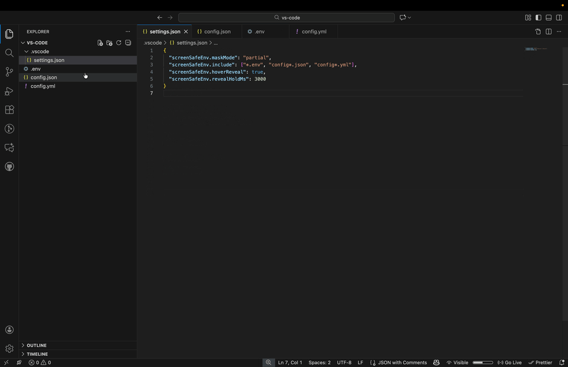

# Screen-Safe-ENV

**Visually conceal sensitive environment variables in VS Code during screen sharing, streaming, or recording.**

Screen-Safe-ENV helps developers protect sensitive data (like API keys, passwords, and tokens) in `.env` files by visually masking them in the editor. The underlying file content remains unchanged—only the display is altered.

## Features

- 🔒 **Visual Concealment**: Automatically hides values in `.env` files (e.g., `API_KEY=*****`).
- 🛡️ **Zero Data Risk**: Does not modify your files and does not store or transmit your secrets.
- ⚙️ **Configurable Masking**: Choose between solid blocks, length-preserving masks, or partial masking.
- 👁️ **Toggle Control**: Quickly toggle concealment on/off via command or status bar.
- 🖱️ **Temporary Reveal**: Peek at secrets by hovering (optional) or using the "Reveal Hold" command.
- 📝 **Customizable**: Configure which files to include and which keys to exclude (e.g., `PORT`, `DEBUG`).

## Usage

The extension activates automatically for `.env` files.

### Commands

- `Screen Safe Env: Toggle Hide/Show`: Switch concealment on or off globally.
- `Screen Safe Env: Temporarily Reveal Values`: Reveal values while the command is active (useful for keybindings).
- `Screen Safe Env: Force Rescan Current File`: Manually trigger a scan if the file content changes externally.

### Configuration

You can customize the extension in your VS Code `settings.json`:

| Setting | Default | Description |
| :--- | :--- | :--- |
| `screenSafeEnv.enable` | `true` | Enable/disable the extension. |
| `screenSafeEnv.maskMode` | `"solid"` | Mask style: `"solid"`, `"lengthPreserving"`, or `"partial"`. |
| `screenSafeEnv.include` | `["**/.env*", "*.env"]` | Glob patterns for files to process. |
| `screenSafeEnv.excludeKeys` | `["PORT", "DEBUG"]` | List of keys to keep visible. |
| `screenSafeEnv.hoverReveal` | `false` | Allow revealing values by hovering over them. |
| `screenSafeEnv.revealHoldMs` | `3000` | Duration (ms) for temporary reveal. |

## Safety & Privacy

- **Visual Only**: This extension uses VS Code's decoration API to hide text. It does not encrypt your files.
- **No File Modifications**: The extension never writes to, modifies, or edits any files. All masking is purely visual.
- **No Telemetry**: This extension does not collect, store, or transmit any data whatsoever. Your secrets remain entirely on your machine.
- **No Network Requests**: The extension operates completely offline with no external dependencies or API calls.
- **Workspace Trust**: The extension respects VS Code's Workspace Trust and will not operate in untrusted workspaces by default.
- **Open Source**: All code is available for review at [GitHub](https://github.com/kushalshit27/screen-safe-env).

## License

[MIT](LICENSE)
