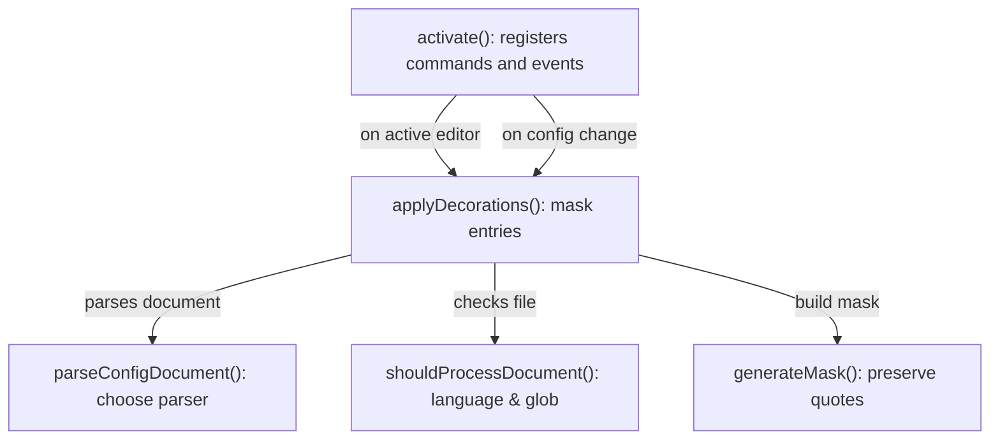

# Architecture Overview
This document provides an architectural overview of the "Screen Safe Env" VS Code extension, which is designed to mask sensitive environment variables in configuration files during screen sharing or recording sessions. The extension leverages the VS Code Decoration API to visually obscure sensitive values without modifying the actual file content.

## Flowchart diagram

## Sequence diagram

```mermaid
sequenceDiagram
    autonumber
    participant User
    participant VSCode
    participant Extension as extension.ts
    participant DecMgr as DecorationManager
    participant GlobMatcher as globMatcher.ts
    participant Parser as parsers/index.ts
    participant EnvParser as envParser.ts
    participant JsonParser as jsonParser.ts
    participant YamlParser as yamlParser.ts
    participant HoverProv as EnvHoverProvider
    participant StatusBar

    Note over User,StatusBar: Extension Activation Flow
    VSCode->>+Extension: activate()
    activate Extension
    Extension->>DecMgr: new DecorationManager()
    Extension->>StatusBar: createStatusBarItem()
    Extension->>Extension: registerToggleCommand()
    Extension->>Extension: registerRevealCommand()
    Extension->>Extension: registerRescanCommand()
    Extension->>HoverProv: registerHoverProvider()
    
    Note over Extension: Check if editor is open
    alt Active Editor Exists
        Extension->>DecMgr: applyDecorations(editor)
    end
    
    Extension->>VSCode: Subscribe to events:<br/>- onDidChangeActiveTextEditor<br/>- onDidChangeTextDocument (debounced 150ms)<br/>- onDidChangeConfiguration
    deactivate Extension

    Note over User,StatusBar: Document Open/Switch Flow
    User->>VSCode: Opens .env / JSON / YAML file
    VSCode->>Extension: onDidChangeActiveTextEditor
    activate Extension
    Extension->>+DecMgr: applyDecorations(editor)
    
    Note over DecMgr: Check if masking enabled
    DecMgr->>DecMgr: isEnabled(documentUri)
    
    alt Masking Disabled
        DecMgr->>DecMgr: clearDecorations(editor)
        DecMgr-->>-Extension: Return (no masking)
    else Masking Enabled
        DecMgr->>+GlobMatcher: shouldProcessDocument(document)
        
        Note over GlobMatcher: Validate file type
        GlobMatcher->>GlobMatcher: Check SUPPORTED_LANGUAGE_IDS<br/>(dotenv, json, jsonc, yaml)
        GlobMatcher->>GlobMatcher: matchesGlobPatterns()<br/>(e.g., **/.env*, **/*.json)
        GlobMatcher-->>-DecMgr: boolean (should process)
        
        alt File Not Supported
            DecMgr-->>Extension: Return (skip)
        else File Supported
            DecMgr->>+Parser: parseConfigDocument(document)
            
            Parser->>Parser: detectFileType()<br/>(by languageId & extension)
            
            alt File Type: .env
                Parser->>+EnvParser: parseEnvDocument(document)
                Note over EnvParser: Parse KEY=VALUE format<br/>Handle export prefix, quotes<br/>Skip comments & empty lines
                EnvParser-->>-Parser: EnvEntry[]
            else File Type: JSON
                Parser->>+JsonParser: parseJsonDocument(document)
                Note over JsonParser: Parse JSON key-value pairs<br/>Include quotes in value range<br/>Handle nested objects (flattened keys)
                JsonParser-->>-Parser: EnvEntry[]
            else File Type: YAML
                Parser->>+YamlParser: parseYamlDocument(document)
                Note over YamlParser: Parse key: value format<br/>Handle nested keys (dot notation)<br/>Skip comments
                YamlParser-->>-Parser: EnvEntry[]
            end
            
            Parser-->>-DecMgr: EnvEntry[]<br/>{key, value, line, valueStart, valueEnd}
            
            DecMgr->>DecMgr: filterExcludedKeys()<br/>(e.g., PORT, DEBUG)
            DecMgr->>DecMgr: getMaskMode()<br/>(solid/lengthPreserving/partial)
            
            loop For Each Entry
                DecMgr->>DecMgr: createDecoration(entry, maskMode)
                DecMgr->>DecMgr: generateMask(value, mode)
                Note over DecMgr: Handle quoted JSON values<br/>Apply mask: partial shows "se***et"<br/>solid shows "*****"<br/>lengthPreserving shows "******"
            end
            
            DecMgr->>VSCode: editor.setDecorations()<br/>(color: transparent + before pseudo-element)
            Note over VSCode: Visual masks applied<br/>File content NEVER modified
            DecMgr-->>Extension: Decorations applied
        end
    end
    deactivate Extension

    Note over User,StatusBar: Document Edit Flow (Debounced)
    User->>VSCode: Types in document
    VSCode->>Extension: onDidChangeTextDocument (event)
    activate Extension
    Note over Extension: Debounce 150ms
    Extension->>DecMgr: applyDecorations(editor)
    Note over DecMgr: Re-parse and re-apply decorations<br/>(same flow as above)
    deactivate Extension

    Note over User,StatusBar: Toggle Masking Command
    User->>StatusBar: Clicks status bar item
    StatusBar->>VSCode: Execute command
    VSCode->>Extension: screenSafeEnv.toggleMasking
    activate Extension
    Extension->>VSCode: getConfiguration('screenSafeEnv')
    Extension->>VSCode: update('enable', !currentValue)
    Note over VSCode: Triggers onDidChangeConfiguration
    VSCode->>Extension: onDidChangeConfiguration
    Extension->>StatusBar: updateStatusBar()<br/>(Show "🔒 Masked" or "👁 Visible")
    Extension->>DecMgr: onConfigurationChanged()
    DecMgr->>DecMgr: Refresh all editors
    loop For Each Visible Editor
        DecMgr->>DecMgr: applyDecorations(editor)
    end
    deactivate Extension

    Note over User,StatusBar: Reveal Values Command (Temporary)
    User->>VSCode: Execute "Reveal Values Temporarily"
    VSCode->>Extension: screenSafeEnv.revealValues
    activate Extension
    Extension->>DecMgr: clearAllDecorations()
    Note over DecMgr: Remove all visual masks
    Extension->>VSCode: showInformationMessage()<br/>"Values revealed (15s). Be careful!"
    Note over Extension: Wait 15 seconds
    par After 15 seconds
        Extension->>DecMgr: Re-apply decorations
        Note over DecMgr: Automatically re-mask values
    end
    deactivate Extension

    Note over User,StatusBar: Rescan Document Command
    User->>VSCode: Execute "Rescan Current Document"
    VSCode->>Extension: screenSafeEnv.rescanDocument
    activate Extension
    Extension->>DecMgr: applyDecorations(activeEditor)
    Note over DecMgr: Force immediate re-parse<br/>and re-decoration
    Extension->>VSCode: showInformationMessage()<br/>"Document rescanned"
    deactivate Extension

    Note over User,StatusBar: Hover Reveal Flow (If Enabled)
    User->>VSCode: Hovers over masked value
    VSCode->>+HoverProv: provideHover(document, position)
    
    HoverProv->>HoverProv: isMaskingEnabled()
    HoverProv->>HoverProv: isHoverRevealEnabled()
    
    alt Hover Reveal Disabled
        HoverProv-->>-VSCode: null (no hover)
    else Hover Reveal Enabled
        HoverProv->>Parser: parseConfigDocument(document)
        Parser-->>HoverProv: EnvEntry[]
        
        HoverProv->>HoverProv: filterExcludedKeys()
        HoverProv->>HoverProv: findEntryAtPosition(position)
        
        alt Entry Found at Position
            HoverProv->>VSCode: Return Hover with:<br/>⚠️ Privacy Warning<br/>Key & Unmasked Value<br/>Info Notice
            Note over VSCode: User sees actual value<br/>with privacy warning overlay
        else No Entry Found
            HoverProv-->>VSCode: null (no hover)
        end
    end

    Note over User,StatusBar: Configuration Change Flow
    User->>VSCode: Changes settings<br/>(maskMode, excludeKeys, includePatterns, etc.)
    VSCode->>Extension: onDidChangeConfiguration
    activate Extension
    Extension->>StatusBar: updateStatusBar()
    Extension->>DecMgr: onConfigurationChanged()
    DecMgr->>DecMgr: Refresh all editors
    loop For Each Visible Editor
        DecMgr->>DecMgr: applyDecorations(editor)
        Note over DecMgr: Re-apply with new settings<br/>(scope config to document URI)
    end
    deactivate Extension

    Note over User,StatusBar: Safety Constraints (Always Enforced)
    rect rgb(255, 240, 240)
        Note over Extension,DecMgr: ✅ File content NEVER modified (Decoration API only)<br/>✅ No telemetry/network requests (fully offline)<br/>✅ Workspace Trust required (disabled in untrusted workspaces)<br/>✅ Configuration scoped to document URI<br/>✅ Privacy warnings shown on hover reveal
    end
```

## UML Diagram

```mermaid
classDiagram
    %% Core Extension Module
    class Extension {
        <<module>>
        -decorationManager: DecorationManager
        -statusBarItem: StatusBarItem
        -debounceTimer: NodeJS.Timeout
        +activate(context: ExtensionContext) void
        +deactivate() void
        -updateStatusBar() void
        -debouncedRefresh(editor: TextEditor) void
    }

    %% Decoration Manager
    class DecorationManager {
        -decorationType: TextEditorDecorationType
        -disposables: Disposable[]
        +constructor()
        -createDecorationType() void
        -getMaskMode(documentUri: Uri) MaskMode
        -getExcludedKeys(documentUri: Uri) string[]
        -isEnabled(documentUri: Uri) boolean
        -generateMask(value: string, mode: MaskMode) string
        -generateMaskForInnerValue(value: string, mode: MaskMode) string
        +applyDecorations(editor: TextEditor) void
        -createDecoration(entry: EnvEntry, mode: MaskMode) DecorationOptions
        +clearDecorations(editor: TextEditor) void
        +clearAllDecorations() void
        +refreshAllDecorations() void
        +onConfigurationChanged() void
        +dispose() void
    }

    %% Mask Mode Type
    class MaskMode {
        <<enumeration>>
        solid
        lengthPreserving
        partial
    }

    %% Entry Interface
    class EnvEntry {
        <<interface>>
        +key: string
        +value: string
        +line: number
        +valueStart: number
        +valueEnd: number
    }

    %% Parser Module
    class ParserModule {
        <<module>>
        +parseConfigDocument(document: TextDocument) EnvEntry[]
        +detectFileType(document: TextDocument) ConfigFileType
        -isJsonDocument(document: TextDocument) boolean
        -isYamlDocument(document: TextDocument) boolean
    }

    %% File Type
    class ConfigFileType {
        <<enumeration>>
        env
        json
        yaml
        unknown
    }

    %% Env Parser
    class EnvParser {
        <<module>>
        +parseEnvDocument(document: TextDocument) EnvEntry[]
        +filterExcludedKeys(entries: EnvEntry[], excludeKeys: string[]) EnvEntry[]
        -parseValue(text: string, start: number) ParseResult
    }

    %% JSON Parser
    class JsonParser {
        <<module>>
        +parseJsonDocument(document: TextDocument) EnvEntry[]
    }

    %% YAML Parser
    class YamlParser {
        <<module>>
        +parseYamlDocument(document: TextDocument) EnvEntry[]
        -parseYamlValue(text: string, start: number) ParseResult
        -findInlineComment(text: string) number
    }

    %% Hover Provider
    class EnvHoverProvider {
        -getConfig(documentUri: Uri) WorkspaceConfiguration
        -isHoverRevealEnabled(documentUri: Uri) boolean
        -isMaskingEnabled(documentUri: Uri) boolean
        -getExcludedKeys(documentUri: Uri) string[]
        -findEntryAtPosition(entries: EnvEntry[], position: Position) EnvEntry
        +provideHover(document: TextDocument, position: Position, token: CancellationToken) Hover
    }

    %% Glob Matcher Utility
    class GlobMatcher {
        <<module>>
        +SUPPORTED_LANGUAGE_IDS: string[]
        +shouldProcessDocument(document: TextDocument) boolean
        +getIncludePatterns() string[]
        -matchesGlobPatterns(uri: Uri, patterns: string[]) boolean
        -isConfigFileByExtension(document: TextDocument) boolean
    }

    %% Command: Toggle
    class ToggleCommand {
        <<module>>
        +COMMAND_ID: string
        +registerToggleCommand(context: ExtensionContext) void
        -toggleHideShow() Promise~void~
    }

    %% Command: Reveal
    class RevealCommand {
        <<module>>
        +COMMAND_ID: string
        +registerRevealCommand(context: ExtensionContext, manager: DecorationManager) void
        -createRevealHandler(manager: DecorationManager) Function
    }

    %% Command: Rescan
    class RescanCommand {
        <<module>>
        +COMMAND_ID: string
        +registerRescanCommand(context: ExtensionContext, manager: DecorationManager) void
        -createRescanHandler(manager: DecorationManager) Function
    }

    %% VS Code API Interfaces (External)
    class TextEditor {
        <<interface>>
        +document: TextDocument
        +setDecorations(type: TextEditorDecorationType, ranges: DecorationOptions[]) void
    }

    class TextDocument {
        <<interface>>
        +uri: Uri
        +languageId: string
        +fileName: string
        +lineCount: number
        +getText() string
        +lineAt(line: number) TextLine
    }

    class HoverProvider {
        <<interface>>
        +provideHover(document: TextDocument, position: Position, token: CancellationToken) ProviderResult~Hover~
    }

    %% Relationships

    %% Extension relationships
    Extension ..> DecorationManager : creates
    Extension ..> ToggleCommand : registers
    Extension ..> RevealCommand : registers
    Extension ..> RescanCommand : registers
    Extension ..> EnvHoverProvider : registers
    Extension ..> TextEditor : uses

    %% DecorationManager relationships
    DecorationManager ..> ParserModule : uses
    DecorationManager ..> GlobMatcher : uses
    DecorationManager ..> EnvEntry : processes 1..*
    DecorationManager ..> MaskMode : uses
    DecorationManager ..> TextEditor : decorates
    DecorationManager ..> EnvParser : uses (filterExcludedKeys)

    %% Parser relationships
    ParserModule ..> ConfigFileType : returns
    ParserModule ..> EnvParser : delegates
    ParserModule ..> JsonParser : delegates
    ParserModule ..> YamlParser : delegates
    ParserModule ..> TextDocument : parses
    ParserModule ..> EnvEntry : returns 0..*

    %% Individual parser relationships
    EnvParser ..> EnvEntry : returns 0..*
    EnvParser ..> TextDocument : parses
    JsonParser ..> EnvEntry : returns 0..*
    JsonParser ..> TextDocument : parses
    YamlParser ..> EnvEntry : returns 0..*
    YamlParser ..> TextDocument : parses

    %% Hover Provider relationships
    EnvHoverProvider ..|> HoverProvider : implements
    EnvHoverProvider ..> ParserModule : uses
    EnvHoverProvider ..> EnvParser : uses (filterExcludedKeys)
    EnvHoverProvider ..> EnvEntry : processes 1..*
    EnvHoverProvider ..> TextDocument : reads

    %% Command relationships
    ToggleCommand ..> DecorationManager : triggers refresh
    RevealCommand ..> DecorationManager : clears/reapplies
    RescanCommand ..> DecorationManager : triggers applyDecorations

    %% GlobMatcher relationships
    GlobMatcher ..> TextDocument : validates

    %% Click callbacks for navigation
    click Extension call linkCallback("/screen-safe-env/src/extension.ts#L53")
    click DecorationManager call linkCallback("/screen-safe-env/src/decorationManager.ts#L15")
    click EnvEntry call linkCallback("/screen-safe-env/src/parsers/envParser.ts#L10")
    click MaskMode call linkCallback("/screen-safe-env/src/decorationManager.ts#L9")
    click ParserModule call linkCallback("/screen-safe-env/src/parsers/index.ts#L60")
    click EnvParser call linkCallback("/screen-safe-env/src/parsers/envParser.ts#L37")
    click JsonParser call linkCallback("/screen-safe-env/src/parsers/jsonParser.ts#L16")
    click YamlParser call linkCallback("/screen-safe-env/src/parsers/yamlParser.ts#L15")
    click EnvHoverProvider call linkCallback("/screen-safe-env/src/hoverProvider.ts#L13")
    click GlobMatcher call linkCallback("/screen-safe-env/src/utils/globMatcher.ts#L103")
    click ToggleCommand call linkCallback("/screen-safe-env/src/commands/toggle.ts#L27")
    click RevealCommand call linkCallback("/screen-safe-env/src/commands/reveal.ts#L36")
    click RescanCommand call linkCallback("/screen-safe-env/src/commands/rescan.ts#L35")
```

